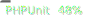
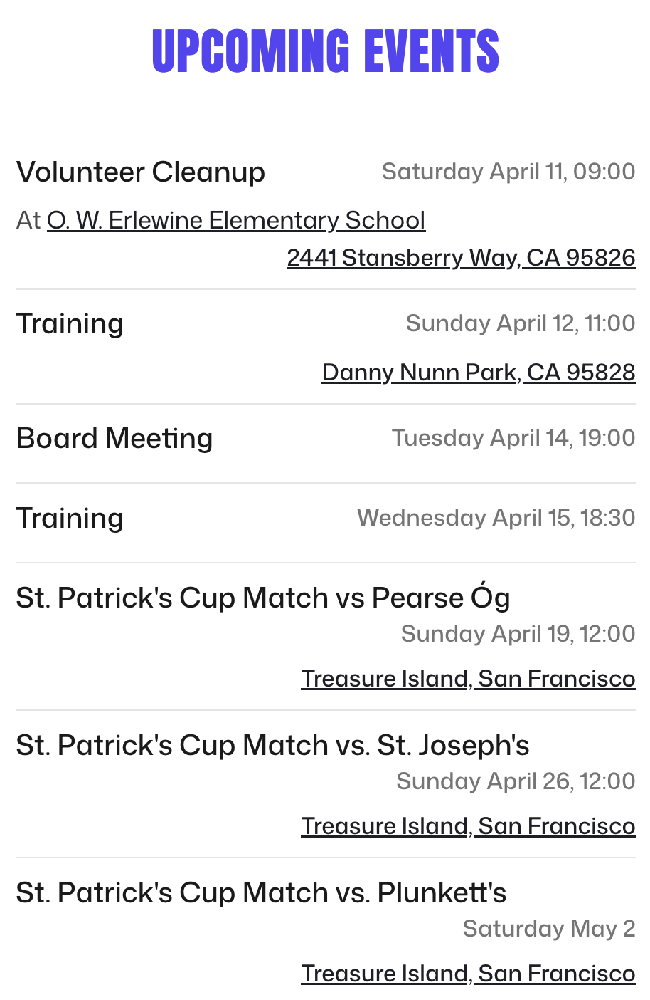
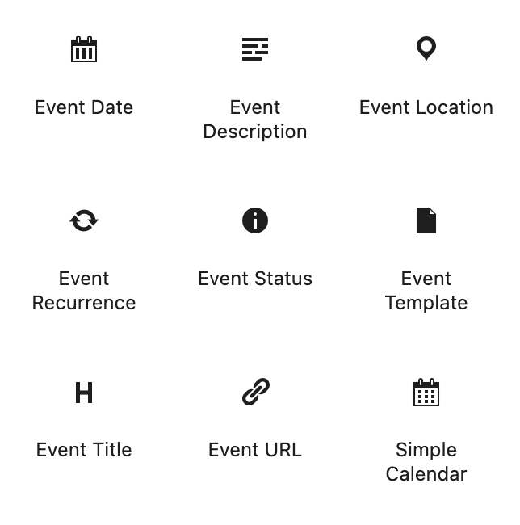
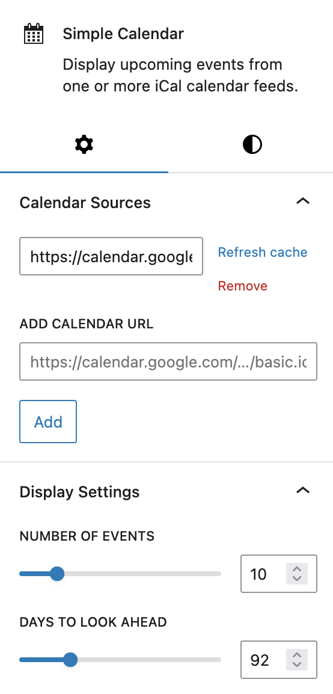
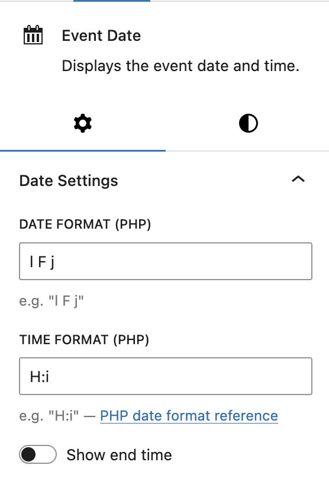
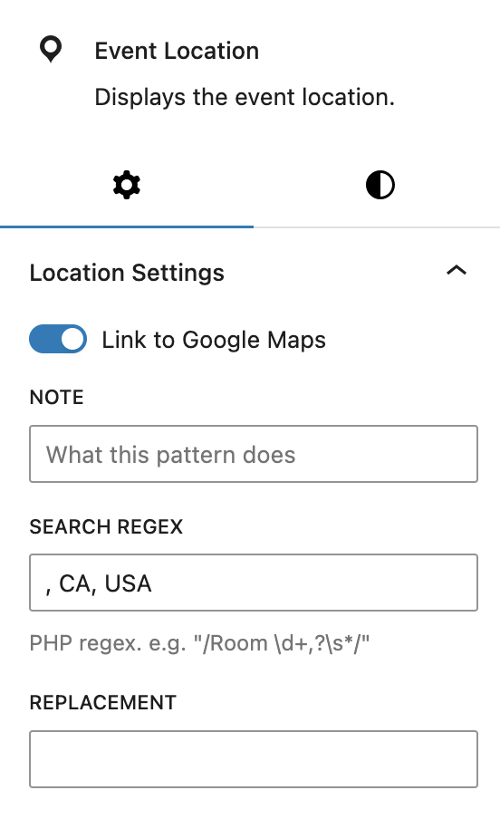

     

# BH WP Simple Calendar

WordPress block for displaying `.ics`/Google calendar.

# Overview

This is effectively a fork/rewrite of [Simple Google Calendar Widget](https://wordpress.org/plugins/simple-google-calendar-widget/), one of the first plugins I [_tried_](https://wordpress.org/support/topic/v3-api-update/) contributing to. 

Live on [SacramentoGAA.org](https://sacramentogaa.org).

## Frontend

## Backend

The plugin adds a few new blocks. The main one is Simple Calendar and the others are only available to insert inside that block (via Event Template).

The main block requires setting the calendar URL. Probably a Google calendar link but any `.ics` URL should work. Calendars are cached for an hour and cache can be flushed in the UI. 

Use PHP date format. Time is separate so all-day events only display the date. Optionally display the end time,

Event location can link to Google Maps and regexes can be added to modify the address, e.g. no need to display "CA, USA" on every event for a local club, but that location information is needed for the Maps link.

## Deprecated

* Widget functionality/implementation should still work. Templates can be overridden in your child theme: `calendar-template-1.php`,  `calendar-item-template-1.php`.

# Notes

* Cache flushes hourly, whenever the post the calendar in on is saved, or by clicking the Refresh Cache button in the block UI
* Formatting in event descriptions in Google Calendar displays correctly (no work on my part!)

# TODO

* Allow multiple calendars to be displayed in the same block. I.e. a club could split its calendar into training/matches/social/management so people can subscribe to only what they wish, but all can be displayed on the website. (WIP)
* Clicking an event date should display an add-to-calendar dialog

# Acknowledgements

* The original developers of [Simple Google Calendar Widget](https://wordpress.org/plugins/simple-google-calendar-widget/): Nico Boehr (nboehr), [Matthew Pemrich](https://github.com/pemrich), [Bram Waasdorp](https://github.com/bramwaas/)
* [Nik McLaughlin](https://github.com/nikmclaughlin) for running [Plugin Jam](https://pluginjam.com/) which helped motivate the work adding individual blocks 
